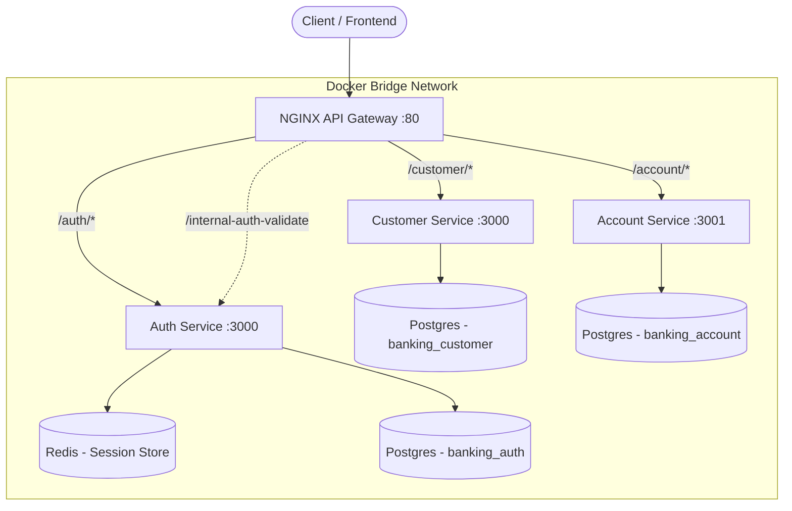
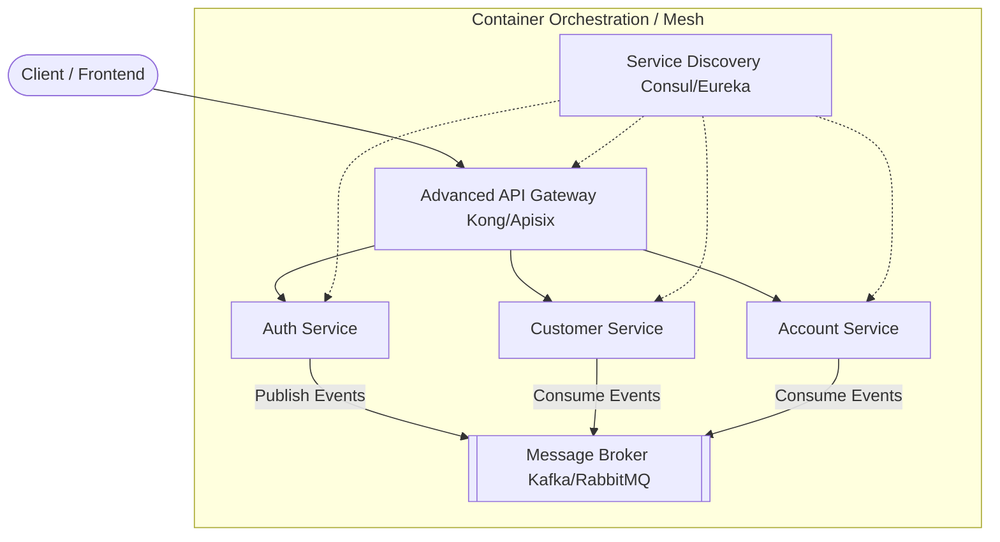
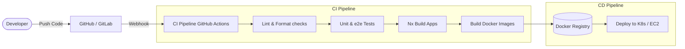

# Banking App Microservices Architecture Report

This document details the architectural analysis of the current NestJS Monorepo (Nx) project against specific enterprise design criteria. It provides a breakdown of what is currently implemented, what is missing explicitly, and how to implement the missing components.

---

## 1. High Level Design Document

The current architecture is a classic Microservices pattern using API Gateway routing and synchronous communication, orchestrated via Docker Compose.

### Current Architecture

### Target Architecture (Including Missing Components)

To meet advanced architectural criteria (Service Discovery, Asynchronous Communication), the system should evolve:

---

## 2. CI/CD Diagram

Continuous Integration and Continuous Deployment (CI/CD) pipelines automate testing, building, and deploying the microservices.

### How to implement CI/CD:
1. **GitHub Actions:** Create a file `.github/workflows/ci.yml`.
2. Define a job that runs `pnpm install`, `pnpm run lint`, and `pnpm run test`.
3. Utilize Nx's `affected` commands (e.g., `pnpm nx affected:build`) to only build and deploy services that changed.

---

## 3. Postman Collection of APIs

A Postman collection has been generated and added to the root of the repository as:
`Banking_App_API_Collection.postman_collection.json`

### How to use it:
1. Open Postman.
2. Go to **File > Import...** and select the `.json` file.
3. The collection is configured to hit `http://localhost` (the NGINX Gateway) by default.
4. It includes endpoints for registering users, logging in, and checking the health of the Gateway, Customer, and Account services.

---

## 4. Source Code of Microservices Demonstration

The project leverages an Nx Monorepo structure containing all source code inside the `apps/` directory:
- `apps/auth/`: Core authentication, Redis session handling, TypeORM user entities.
- `apps/customer/`: GraphQL-based microservice for customer management.
- `apps/account/`: REST-based account service.

### Containerisation with Docker
- **Present:** **Yes**. Docker is successfully implemented.
- **Details:** Each service has its own `Dockerfile` located at `apps/<service>/Dockerfile`. A root `docker-compose.yml` orchestrates all services (Auth, Customer, Account), the PostgreSQL database, Redis, and the NGINX API Gateway. They share a `banking_network`.

### Service Discovery
- **Present:** **Partial (Docker DNS only)**.
- **Missing Explicitly:** A dedicated Service Discovery registry like **Consul**, **Eureka**, or **Kubernetes CoreDNS** for dynamic scaling.
- **Details:** Currently, NGINX hardcodes upstream hostnames (e.g., `http://banking_auth:3000`). This works for basic Docker Compose setups via Docker's internal DNS but fails if services scale dynamically across multiple server nodes.
- **How to implement:**
  1. Add a Consul or Eureka container to `docker-compose.yml`.
  2. Install a NestJS integration package (e.g., `@nestjs/microservices` with a custom strategy or third-party Consul modules).
  3. Modify the `main.ts` of each app to register itself with the discovery service upon startup.
  4. Modify the API Gateway to query the discovery service for IP addresses before routing requests.

### API Gateway
- **Present:** **Yes**.
- **Details:** Provided by NGINX (`nginx.conf` mounted via Docker). It successfully handles rate-limiting (`limit_req_zone`), path-based routing (`/auth/`, `/customer/`, `/account/`), and **Internal Authentication Validation** (acting as a guard for downstream protected services).
- **How to enhance:** While NGINX is a valid gateway, for enterprise NestJS ecosystems, you might replace NGINX with **Kong**, **Apache APISIX**, or a dedicated NestJS-based Gateway using `@nestjs/gateway` or GraphQL Federation for deeper protocol support.

### Communication Pattern: Synchronous vs Asynchronous
- **Synchronous Communication:**
  - **Present:** **Yes**.
  - **Details:** Achieved via HTTP REST. NGINX calls microservices synchronously. NGINX also synchronously calls the Auth service via `auth_request /internal-auth-validate` before allowing traffic to Account/Customer services.
- **Asynchronous Communication:**
  - **Present:** **No**.
  - **Missing Explicitly:** There is no Message Broker or Event Bus implemented for fire-and-forget or pub/sub communication between the microservices.
  - **Details:** If the Auth service wants to tell the Customer service a new user was created, it currently cannot do so without blocking the request.
  - **How to implement:**
    1. Add **RabbitMQ** or **Apache Kafka** to `docker-compose.yml`.
    2. Import `@nestjs/microservices` into your applications.
    3. Configure `ClientsModule.register()` in `app.module.ts` using the `Transport.RMQ` or `Transport.KAFKA` strategy.
    4. Emit events like `this.client.emit('user_created', payload)`.
    5. In the receiving service, use `@EventPattern('user_created')` to consume the message asynchronously.

---

## Executive Summary & Action Plan

| Criteria | Status | Action Required |
| :--- | :---: | :--- |
| **High Level Design Document** | ✅ Provided | Review diagrams in this file. |
| **CI/CD Diagram** | ✅ Provided | Review diagrams in this file. Setup `.github/workflows`. |
| **Postman Collection** | ✅ Provided | Import the generated JSON file into Postman. |
| **Source Code structure** | ✅ Exists | Keep using Nx structure. |
| **Docker Containerisation** | ✅ Exists | No action required. Setup works well. |
| **API Gateway** | ✅ Exists | Consider upgrading to Kong/Apisix if API management features (metrics, deep auth) are needed. |
| **Service Discovery** | ❌ Missing | Implement Consul/Eureka or rely on Kubernetes if deploying to a cluster. Update NestJS startup scripts. |
| **Asynchronous Comm.** | ❌ Missing | Add RabbitMQ/Kafka to docker-compose. Use `@nestjs/microservices` to emit and consume events. |

By addressing the missing Service Discovery and Asynchronous Message Broker components, the system will fully meet robust enterprise microservice architecture standards.