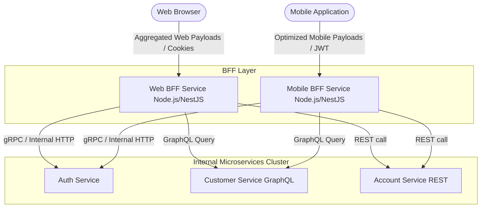

# Backend for Frontend (BFF) Pattern Analysis

This document outlines the current state of the Backend for Frontend (BFF) pattern within the Banking Application repository, alongside a proposed architectural shift and use cases.

---

## 1. Current Architecture: Is there a BFF Pattern?

**No, a Backend for Frontend (BFF) pattern is NOT currently implemented in this repository.**

### Current State Analysis:
- The system currently utilizes a **Direct-to-Microservice via API Gateway** pattern.
- A single, generic NGINX API Gateway handles all external routing (`nginx.conf`).
- The frontend client directly queries the microservices through this single gateway based on path routing (e.g., `/auth/*`, `/customer/*`, `/account/*`).
- NGINX serves as an aggregation point for routing and internal authentication validation (`/internal-auth-validate`), but it does not aggregate data, shape payloads, or provide dedicated APIs tailored for specific client platforms.
- The microservices (Auth, Customer, Account) expose generic REST and GraphQL APIs that serve all potential clients identically.

---

## 2. What is a BFF Pattern?

The Backend for Frontend (BFF) pattern dictates that instead of having a single, generic API Gateway (or forcing clients to call multiple microservices directly), you create a dedicated backend service (the "BFF") for each specific client interface (e.g., one for the Web App, one for the Mobile App).

The BFF acts as a facade. It sits between the frontend client and the downstream microservices, orchestrating requests, aggregating data, and returning exactly what that specific client needs in a single payload.

---

## 3. BFF Use Cases for this Banking App

Implementing a BFF pattern in this repository would introduce several powerful use cases, especially if the application expands to support multiple platforms.

### Use Case A: Mobile vs. Web App Data Shaping (Over-fetching / Under-fetching)
- **Problem:** The Web Dashboard for a user's account might require 50 data points (account details, recent transactions, customer profile info, branch details). The Mobile App might only have screen real-estate to show 5 data points (current balance and last 3 transactions).
- **BFF Solution:** If the Mobile App calls the generic `Account` and `Customer` microservices directly, it downloads a massive payload, wasting mobile bandwidth and battery. A `Mobile-BFF` service would intercept the mobile request, fetch the heavy data from the microservices internally, strip away the 45 unnecessary fields, and send a lightweight, optimized JSON payload back to the mobile device.

### Use Case B: Request Aggregation (Reducing Latency)
- **Problem:** To render the "Dashboard" screen, the client currently needs to make three separate network requests:
  1. `GET /auth/me` (to get user role)
  2. `GET /customer/{id}` (to get profile info)
  3. `GET /account/balances` (to get funds)
  Each request incurs network latency, especially noticeable on slow mobile networks.
- **BFF Solution:** The client makes a single request to the BFF: `GET /bff/dashboard`. The BFF, sitting securely inside the high-speed Docker/Kubernetes cluster, makes the three requests to the microservices concurrently, aggregates the JSON responses into one object, and returns it to the client.

### Use Case C: Handling Platform-Specific Authentication
- **Problem:** The current system relies on HTTP-Only cookies backed by Redis for web sessions. If a Mobile App or a third-party API client is introduced, they typically rely on JWTs or OAuth2 tokens, which don't map perfectly to the current NGINX cookie-validation flow.
- **BFF Solution:**
  - The `Web-BFF` continues to manage secure HTTP-only cookies with the browser.
  - The `Mobile-BFF` manages JWTs with the mobile device.
  - Both BFFs translate their specific authentication mechanisms into a standardized internal format (like passing `X-User-ID` headers) before communicating with the downstream microservices.

---

## 4. Proposed BFF Architecture Diagram

The following Mermaid diagram illustrates how the architecture would change if a BFF pattern was introduced to support both a Web App and a Mobile App.

### How to implement in this Nx Workspace:
If the decision is made to implement this:
1. Generate new NestJS applications in the Nx workspace: `pnpm nx generate @nestjs/schematics:application web-bff` and `mobile-bff`.
2. Move the internal authentication logic from NGINX into these BFFs.
3. Use NestJS `@nestjs/axios` or GraphQL clients within the BFFs to aggregate data from the `auth`, `customer`, and `account` microservices.