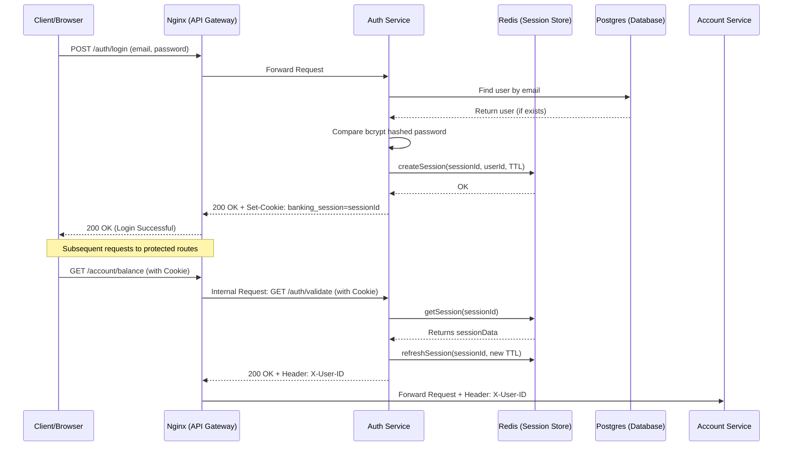

# Banking Authentication Service

This directory contains the `auth` microservice for the banking application. It provides registration, login, logout, password change, and token validation functionality.

## Recent Improvements Implemented

1.  **Cookie `maxAge` Fix:** The `maxAge` for the `banking_session` cookie is now aligned with the Redis session Time-To-Live (TTL) of 1 hour (3,600,000 milliseconds).
2.  **Session Rolling (Refresh Mechanism):** Implemented session rolling in the `validateToken` endpoint. Each successful validation request refreshes the expiration time of the session in Redis and resets the cookie expiration, keeping active users logged in.
3.  **Rate Limiting:** Implemented at the API Gateway (Nginx) level to protect the `/auth/login` and `/auth/register` endpoints from brute-force and credential stuffing attacks. (Configured outside this service codebase).
4.  **Password Strength Validation:** Added a regular expression to the `RegisterDto` to enforce strong password policies (requires uppercase, lowercase, number, and a special character).
5.  **Session Invalidation:** Implemented a `change-password` endpoint that securely handles password updates by proactively invalidating *all* active Redis sessions tied to the user's ID, forcing a re-login across all devices.

---

## Login Mechanism

This service uses **Session-based Authentication via HTTP Cookies backed by Redis**.

### Flow Diagram

---

## Architecture & Design Patterns

### Design Patterns Used
*   **Dependency Injection (DI):** NestJS heavily utilizes DI to inject services (e.g., `AuthService`, `RedisService`) into controllers and other services. This promotes loose coupling and testability.
*   **Decorator Pattern:** Extensive use of TypeScript decorators (`@Controller`, `@Injectable`, `@Get`, `@Post`, `@Body`, etc.) to attach metadata to classes and methods, allowing NestJS to construct the routing and dependency graph dynamically.
*   **Repository Pattern:** Used via TypeORM (`@InjectRepository(User)`) to abstract database interactions. The `AuthService` relies on the repository rather than writing direct SQL queries, allowing for easier mocking during testing and swapping of database providers if necessary.
*   **Data Transfer Object (DTO) Pattern:** Used to define the schema of incoming request payloads (`LoginDto`, `RegisterDto`) and validate them before they reach the controller logic.

### Pros, Cons, and Trade-offs of Session-Based Authentication

**When to use:** Ideal for traditional web applications (browsers) where the server can securely set `HttpOnly` cookies. It's excellent when you need strict, immediate control over active sessions (e.g., forcing a logout, tracking active devices).

**Pros:**
*   **Security:** `HttpOnly`, `Secure`, and `SameSite` cookies are highly resistant to Cross-Site Scripting (XSS) and Cross-Site Request Forgery (CSRF).
*   **Immediate Revocation:** Since the server (via Redis) holds the source of truth for session validity, a session can be destroyed instantly (e.g., on password change or manual logout).
*   **No Payload Exposure:** The cookie only contains an opaque identifier (UUID). Sensitive data is kept on the server.

**Cons/Trade-offs:**
*   **Stateful:** The server must maintain the state (in Redis). This adds complexity and infrastructure requirements compared to stateless tokens like JWT.
*   **Scalability:** While Redis is very fast, every authenticated request requires a network call to the session store.
*   **Mobile Clients:** Managing cookies in native mobile apps can be slightly more cumbersome than simply passing an Authorization header (though still very possible).

---

## Redis Usage Rationale

Redis is utilized as an in-memory session store.

**Why Redis?**
*   **Speed:** Session validation occurs on almost every protected request. Redis stores data in RAM, providing sub-millisecond read times.
*   **TTL Management:** Redis natively supports expiring keys (Time-To-Live). We use this to automatically invalidate idle sessions without writing custom cleanup scripts.
*   **Scalability:** If the Auth service is scaled horizontally (multiple instances), they all share the same Redis instance, ensuring session state is consistent across the cluster.

**Methods Used:**
*   `set(..., 'EX', ttl)`: Creates a session with an expiration time.
*   `get(...)`: Retrieves session data for validation.
*   `expire(...)`: Updates the TTL for "Session Rolling".
*   `del(...)`: Deletes a session upon logout.
*   `keys(...)` (Used carefully in invalidation): Finds all sessions to invalidate a user entirely.

---

## NestJS Flow Explanation

1.  **`main.ts`**: The entry point. It creates the Nest application instance (`NestFactory.create`), binds global middleware (like `cookie-parser`), sets global validation pipes (to strip malicious properties not defined in DTOs), and starts listening on a port.
2.  **Modules (`auth.module.ts`, `app.module.ts`)**: The organizational structure. Modules group related controllers and providers together. `AppModule` is the root module that imports the database connection and the `AuthModule`.
3.  **Controllers (`auth.controller.ts`)**: The presentation layer. They are responsible for handling incoming HTTP requests, extracting data (body, params, cookies), calling the appropriate Service, and returning the response to the client.
4.  **Services (`auth.service.ts`, `redis.service.ts`)**: The business logic layer. Controllers delegate complex tasks (like hashing passwords, interacting with the DB, or talking to Redis) to services.
5.  **TypeORM (`user.entity.ts`)**: An Object-Relational Mapper (ORM). It maps TypeScript classes (`Entities`) to database tables. The `Repository` provided by TypeORM abstracts CRUD operations.
6.  **DTOs (`login.dto.ts`)**: Data Transfer Objects. These classes define the exact shape of data expected from the client. Combined with `class-validator`, they ensure only clean, valid data reaches the controller.

---

## Decorators Explained

*   **`@Controller('auth')`**: Marks a class as a NestJS controller and sets the base route prefix (`/auth`).
*   **`@Injectable()`**: Marks a class as a provider that can be managed by the NestJS IoC (Inversion of Control) container and injected into other classes.
*   **`@Post('login')` / `@Get('validate')` / `@Delete('logout')`**: Route handler decorators. They map specific HTTP methods and paths to the controller's functions.
*   **`@Body()`**: Extracts the entire body object from the HTTP request and binds it to a parameter.
*   **`@Req()` / `@Res()`**: Injects the underlying platform-specific (Express) request or response object. We use `@Res({ passthrough: true })` to set cookies while still letting NestJS handle the final return value.
*   **`@UsePipes(new ValidationPipe(...))`**: Binds a pipe to the route or controller. The `ValidationPipe` uses `class-validator` decorators on the DTO to validate incoming data.
*   **`@InjectRepository(User)`**: Instructs NestJS to inject the TypeORM repository for the `User` entity into the service constructor.
*   **DTO Validation Decorators (`@IsEmail`, `@IsString`, `@MinLength`, `@Matches`, `@IsOptional`)**: Provided by `class-validator`. They define rules that the incoming request body must pass before the controller method executes.

---

## Explicitly Missed / Future Enhancements Noted

While the core improvements were implemented, the following items are noted for future production readiness:

1.  **Removing `@Res()` / Express Coupling:** The controller currently uses `@Res({ passthrough: true })` and Express's `res.cookie()` method. While standard, fully decoupling from Express in NestJS requires creating custom interceptors or decorators to handle cookie setting natively.
2.  **Reverse Lookup Index in Redis:** The `invalidateAllSessionsForUser` method currently uses `redisClient.keys('session:*')` to scan for a user's sessions. In a large production environment, the `KEYS` command is dangerous and slow. A better approach would be to maintain a reverse index (e.g., a Redis `SET` stored at key `user_sessions:<userId>` containing all `sessionId`s for that user) to enable $O(1)$ session invalidation.
3.  **CSRF Protection:** While `SameSite: 'strict'` is excellent mitigation, explicit CSRF tokens are often added for defense-in-depth, especially if non-GET requests are made from a browser client.
4.  **Logging & Monitoring:** Implement structured logging (e.g., Winston/Pino) for authentication failures, rate limit hits, and significant events (password changes) for security auditing.
