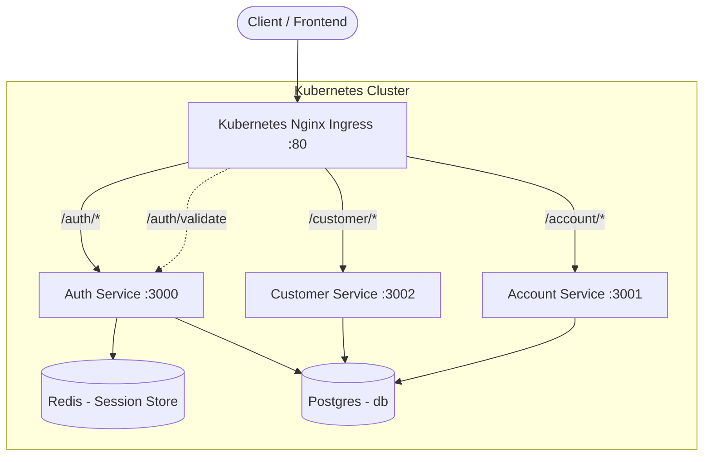
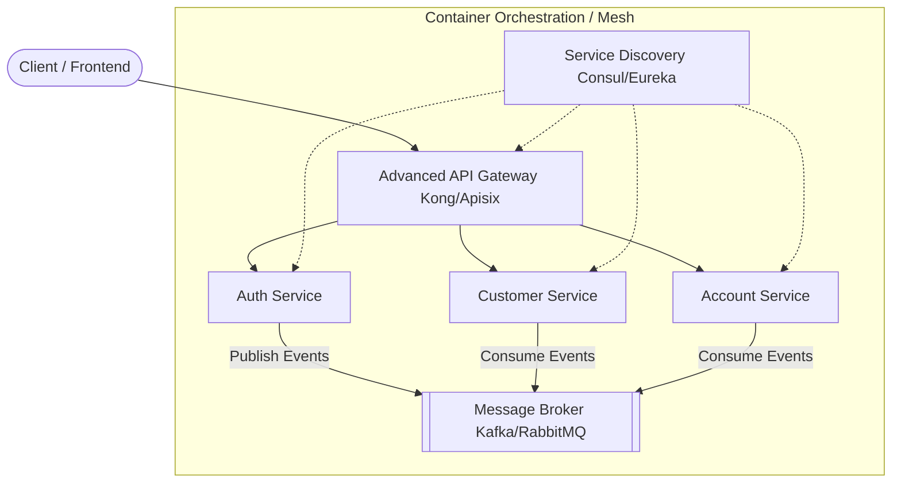
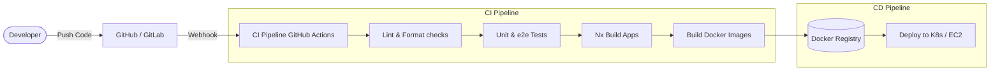

# Banking App Microservices Architecture Report

This document details the architectural analysis of the current NestJS Monorepo (Nx) project against specific enterprise design criteria. It provides a breakdown of what is currently implemented, what is missing explicitly, and how to implement the missing components.

---

## 1. High Level Design Document

The current architecture is a classic Microservices pattern using API Gateway routing and synchronous communication. The environment is actively orchestrating services via Kubernetes using manifests found in the `k8s/` directory.

### Current Architecture

### Target Architecture (Including Missing Components)

To meet advanced architectural criteria (Service Discovery, Asynchronous Communication), the system should evolve:

---

## 2. CI/CD Diagram

Continuous Integration and Continuous Deployment (CI/CD) pipelines automate testing, building, and deploying the microservices.

### How to implement CI/CD:
1. **GitHub Actions:** Create a file `.github/workflows/ci.yml`.
2. Define a job that runs `pnpm install`, `pnpm run lint`, and `pnpm run test`.
3. Utilize Nx's `affected` commands (e.g., `pnpm nx affected:build`) to only build and deploy services that changed.

---

## 3. Postman Collection of APIs

A Postman collection has been generated and added to the root of the repository as:
`Banking_App_API_Collection.postman_collection.json`

### How to use it:
1. Open Postman.
2. Go to **File > Import...** and select the `.json` file.
3. The collection is configured to hit `http://localhost` (the NGINX Gateway) by default.
4. It includes endpoints for registering users, logging in, and checking the health of the Gateway, Customer, and Account services.

---

## 4. Source Code of Microservices Demonstration

The project leverages an Nx Monorepo structure containing all source code inside the `apps/` directory:
- `apps/auth/`: Core authentication, Redis session handling, TypeORM user entities.
- `apps/customer/`: GraphQL-based microservice for customer management.
- `apps/account/`: REST-based account service.

### Containerisation with Docker & Kubernetes
- **Present:** **Yes**. Docker and Kubernetes are successfully implemented.
- **Details:** Each service has its own `Dockerfile` located at `apps/<service>/Dockerfile`. The infrastructure is orchestrated using Kubernetes manifests found in the `k8s/` directory rather than relying on Docker Compose.

### Service Discovery
- **Present:** **Yes**.
- **Details:** Provided natively via Kubernetes CoreDNS and Service manifests (e.g., `postgres-service`, `auth-service`). Microservices interact using these internal DNS hostnames across the cluster.

### API Gateway
- **Present:** **Yes**.
- **Details:** Handled by a Kubernetes NGINX Ingress Controller. It manages rate-limiting, path-based routing (`/auth/`, `/customer/`, `/account/`), and **Internal Authentication Validation** via standard Ingress annotations (acting as an external auth guard).
- **How to enhance:** While NGINX Ingress is a standard choice, for a robust enterprise solution you could upgrade to Kong Ingress or an API Gateway using Apisix for finer traffic control and observability plugins.

- **Asynchronous Communication:**
  - **Present:** **Yes**.
  - **Details:** Implemented via **RabbitMQ** event bus using `@nestjs/microservices`.
  - **Flow:** When a user is created in the `Auth` service, it publishes a `UserCreatedEvent` to the `banking_events_queue`. The `Account` and `Customer` services consume this event to automatically provision accounts and KYC profiles without blocking the main registration flow.

---

## Executive Summary & Action Plan

| Criteria | Status | Action Required |
| :--- | :---: | :--- |
| **High Level Design Document** | ✅ Provided | Review diagrams in this file. |
| **CI/CD Diagram** | ✅ Provided | Review diagrams in this file. Setup `.github/workflows`. |
| **Postman Collection** | ✅ Provided | Import the generated JSON file into Postman. |
| **Source Code structure** | ✅ Exists | Keep using Nx structure. |
| **Docker Containerisation** | ✅ Exists | Continue using Docker and K8s manifests in `k8s/`. |
| **API Gateway** | ✅ Exists | Evaluate Kong or Apisix for extended functionalities beyond the Nginx Ingress. |
| **Service Discovery** | ✅ Exists | Already functioning via Kubernetes Services. |
| **Asynchronous Comm.** | ✅ Implemented | Using RabbitMQ for inter-service events. |

By addressing the missing Service Discovery and Asynchronous Message Broker components, the system will fully meet robust enterprise microservice architecture standards.